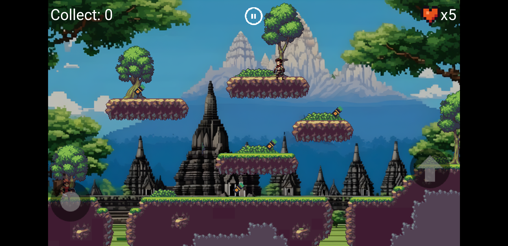
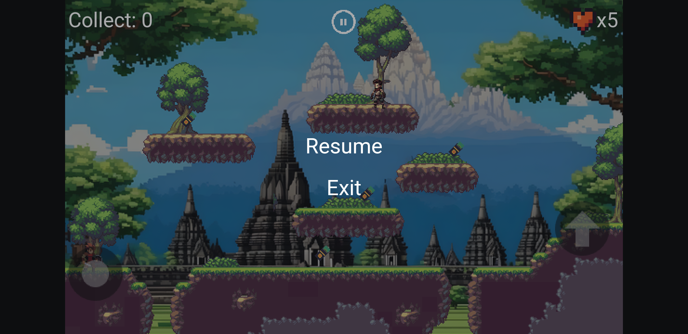

# Sudirman's Guerrilla Gambit

Sudirman's Guerrilla Gambit adalah game aksi-petualangan yang menggambarkan peran Arya, seorang prajurit muda dalam pasukan gerilya yang dipimpin oleh Panglima Besar Sudirman selama Perang Kemerdekaan Indonesia. Game ini mengikuti perjuangan Arya dalam Operasi Jantjil untuk merebut kembali Yogyakarta dari pasukan Belanda.

## Progress

- [Game Design Document (GDD)](https://docs.google.com/document/d/1ZoR7c6ZmBjA7dbyxCpqyGkVfIXOvlD2titNZ2IYLn0I)
- [Presentation (PPT)](https://docs.google.com/presentation/d/1Fd80crdonk-9KBDa61SC38EeSSoX-NCFqN-YcyDTjs0)

## Members

- 202110370311462 - [Bahrul Ulum Fadhlur Rohman](https://github.com/ulumfr)
- 202110370311471 - [Romadhon Wiratama](https://github.com/Wiratama23)
- 202110370311481 - [Muhammad Gus Nadir](https://github.com/mgusnadir)

## Views Game

### Authentication (Auth)

### Display

